# Masters Thesis: Tonestrømme
This repo is documenting my artistic research practice for my masters thesis in Audiodesign. This is a media archaeological examination of the tuningfork oscillator used by Poul la Cour in late 1800 for telegraphy and his experiments with "Tonehjulet" (patented 1878).

## Tonestrømsapparat
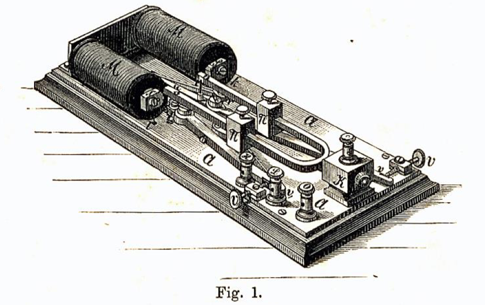
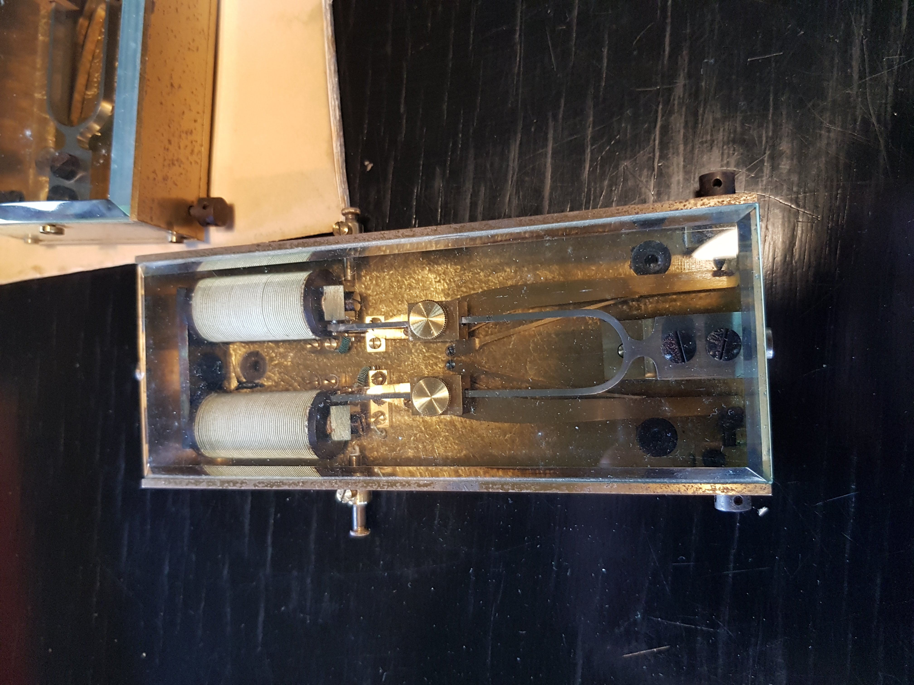
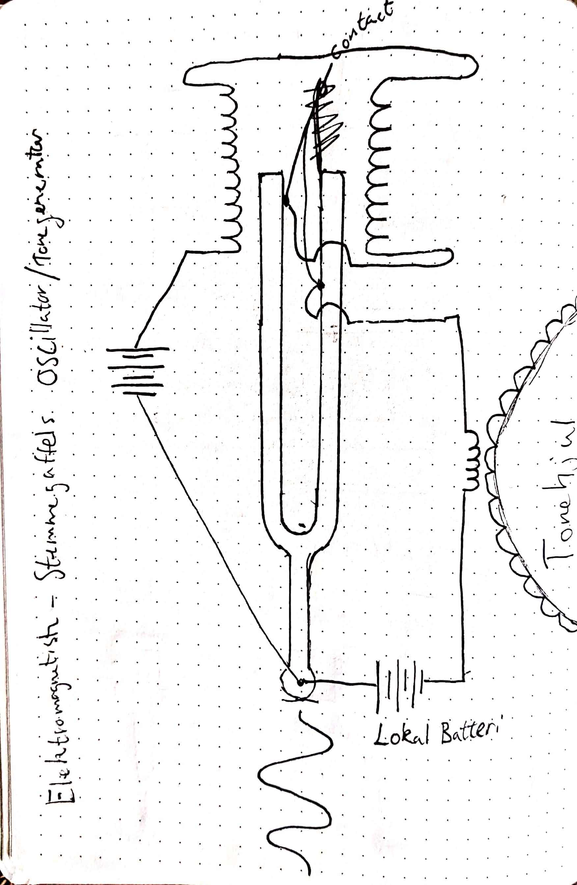
Et *Tonestrømsapparat* består af en stemmegaffel monteret med en spændeskrue ved dets base. Modsat stemmegaflens grene er placeret en elektromagnet med form som en hestesko. Ved indersiden af en af stemmegaffel-grenene er placeret en kontakt i let berøring.
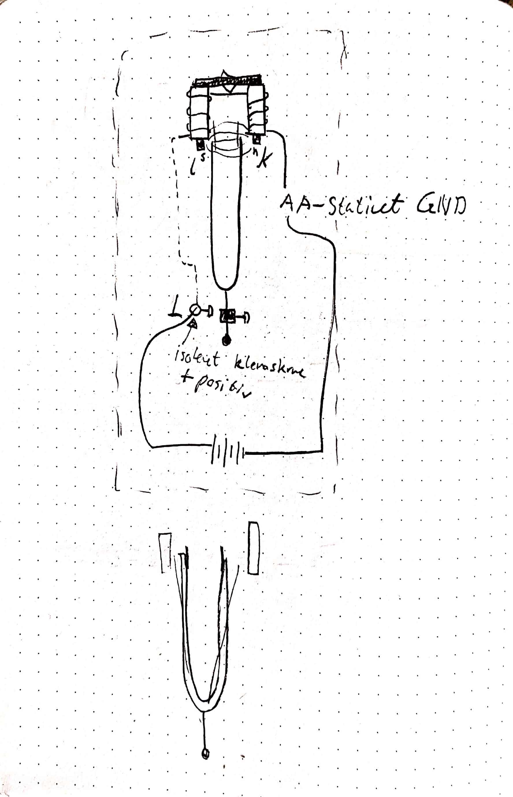

### Generering af en Tonestrøm
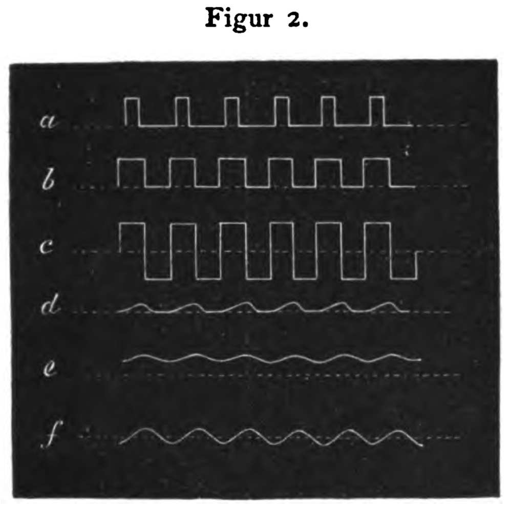
Det Poul la Cour kalder en *tonestrøm* kan i vore dage anses for et audio/analog signal.

Stemmegaflens base er forbundet til GND, den ene af elektromagnetens pins er forbundet til V++, og den anden af elektromagnetens pins er forbundet til en kontakt sat i let berøring ved indersiden af en stemmegaffel-gren.

Følgende er beskrevet hvordan en tonestrøm skabes af et tonestrøms-apparat.

1. Stemmegaflen er i dets naturlige position hvor det ved at berøre kontakten lukker et kredsløb med dets elektromagnet
2. Den nu aktive elektromagnet tiltrækker den ene af stemmegafflens grene der således fjernes fra kontakten og afbryder kredsløbet med elektromagneten
3. idet elektromagneten taber sin magnetisme vender stemmegaflen tilbage til dens naturlige position og således etableres en cyklus fra step 1. igen.

Denne Cyklus hastighed er determineret af den pågældende stemmegaffels naturlige frekvens

Frekvens(Hz), hvor mange gange i sekundet stemmegaffelgrenene går mellem naturlig og udspilet position.

1 Hz = 1 cyklus pr. sekund
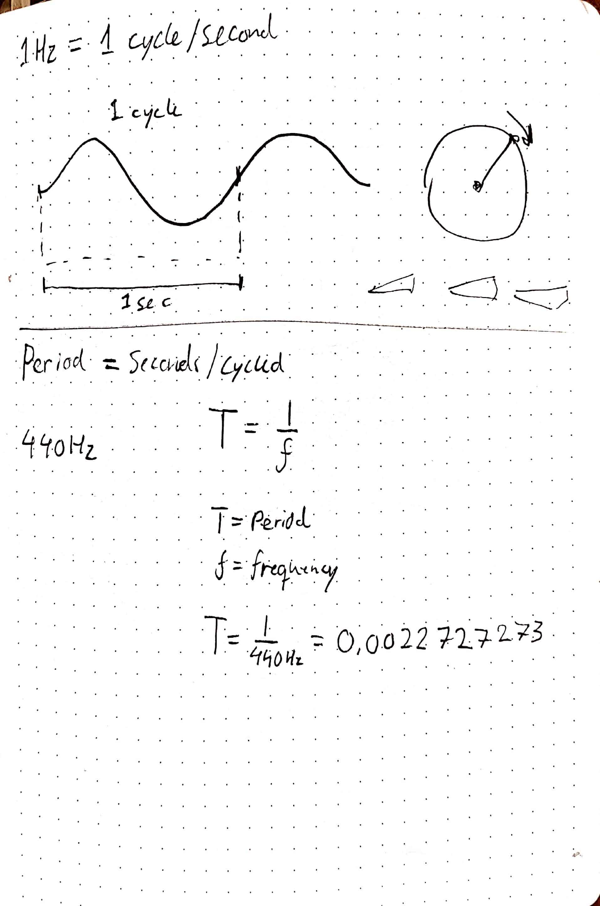

Den mekaniske vibration frembragt af ovenstående cyklus er ofte hørbar.

Denne cyklus er kontinuerlig indtil strømmen slukkes, eller der er dannet så meget sod ved kontakt/stemmegaffel at berøringsfladen ikke længere er god.

## Re-(enactment)construction of "Tonestrømsapparat"
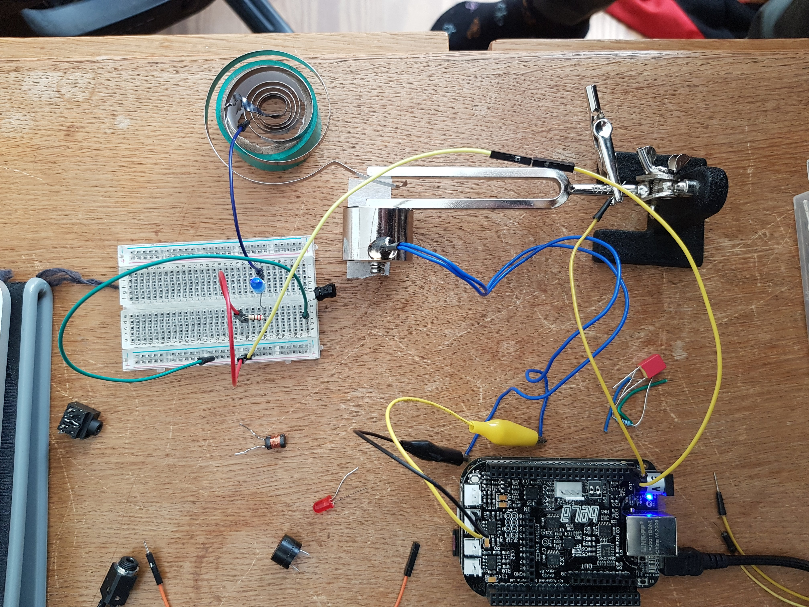
For at kunne udfører nogen form for re-enactment af tonestrømsapparattet kræver det konstruktionen af et apparat.

I min konstruktion har jeg anvendt en 440 Hz stemmegaffel med en 5v elektromagnet. Stemmegaflen er monteret i en 3D printet holder der er fastspændt på en træbundplade. Monteret med en skrue gennem træbundpladet er elektromagneten placeret så den uden at berøre stemmegaflen vil kunne tiltrække gaflens gren med sin magnetiske kraft. Over elektromagneten er monteret en holder ligeledes gennem træbundpladen hvorpå kontakten der kun let berør indersiden af stemmegaflens gren.

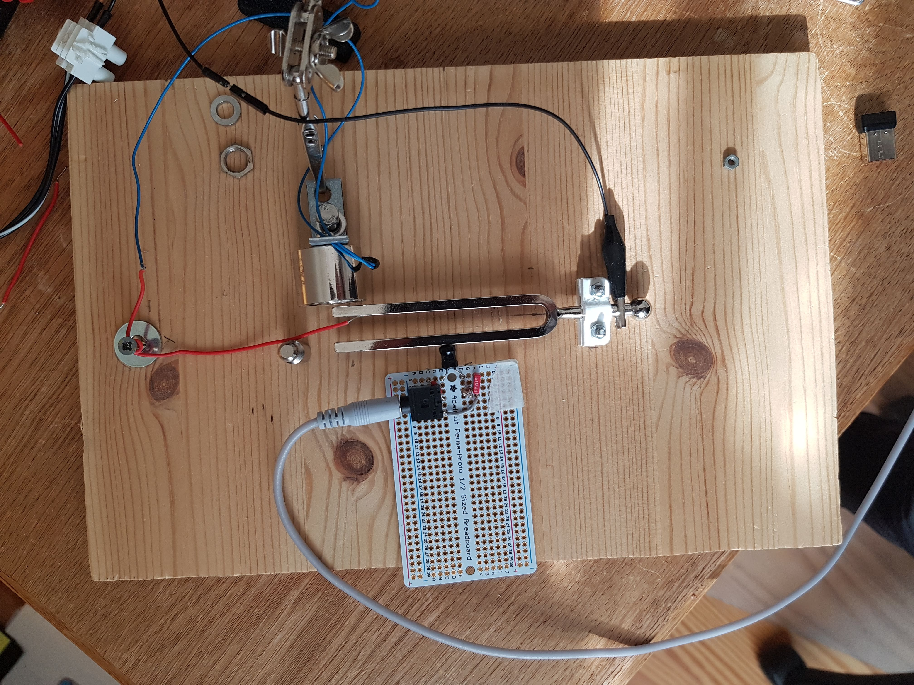

På stemmegaflens bund er et krokkodillenæbs monteret der fobinder stemmegaflen til GND. Den anden del af kredsløbet V++ er forbundet til elektromagneten, der videre er i forbindelse med kontakten.

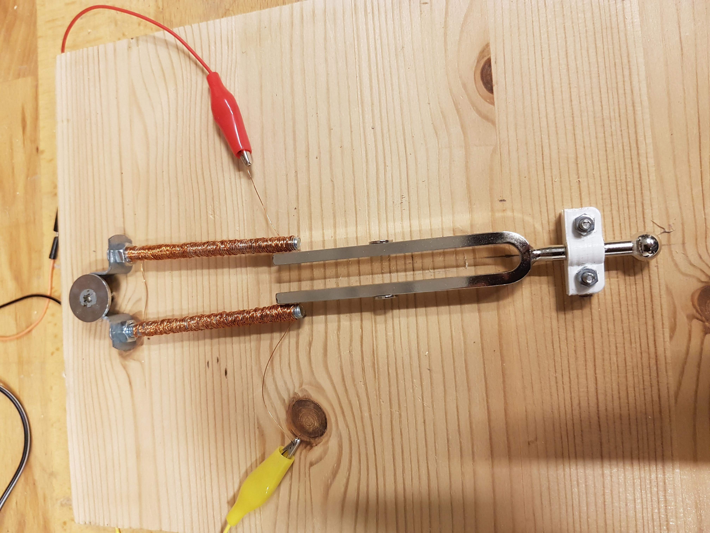
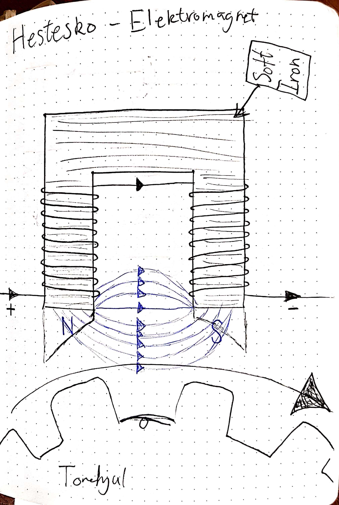

I det originale tonestrømsapparat er der anvendt en hesteskoesmagnet, hvoraf jeg har valgt at anvende en tilsvarende helt almindre 5V stangelektromagnet. Pouls argument for at anvende en hesteskosmagnet er at den grundet sin form kan afgive en stærkere magnetisk påvirkning. Den 5V elektromagnet jeg har valgt at anvende har en kraft der kan løfte op til 5kg, hvilket er rigeligt for at kunne tiltrække stemmegaffel-grenen.

### Fejlkilder
- Kontakten
	- Stivhed
	- gnist sod
	- ekstremt følsom
- Træbundpladen
	- ujævnhed resulterer i pitch ændringer
- 3D-printet stemmegaffel holder
	- tolerancen gør at gaflen kan skubbes igennem og således komme for tæt på elektromagneten
- Krokkodillenæb ledninger, sidder løse, har dårlig kontakt til kredsløbet

### Udfordringer: Kontakt & unipolar vs. bipolar
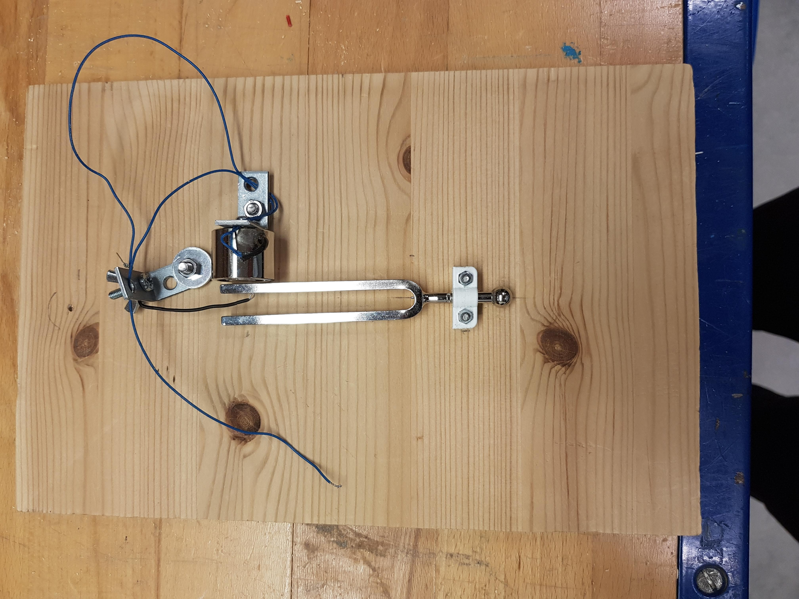
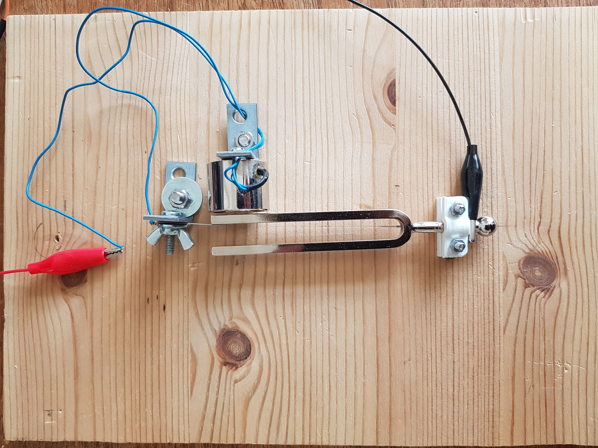
Den første udfordring var at vælge den korrekte form for kontakt. **Graden af stivhed** er vigtig, hvis den er for elastisk giver metallet for meget efter og kommer ud af facon, hvis det er for stift er der ingen vibration mulig. Jeg forsøgte mig med stiv-solidcore ledning, småstykker af "springsteel" af varierende stivhed og bredde, indtil jeg fandt at tøj-sy-nåle havde den bedste stivhed.
 **Bredden på kontakten**, hvis kontakt-fladen er for bred da har gaflen svært ved at bevare vibrationer.Jeg forsøgte mig med stiv-solidcore ledning, småstykker af "springsteel" af varierende stivhed og bredde, indtil jeg fandt at tøj-sy-nåle havde den bedste stivhed og smalle kontaktflade.

Den anden udfordring var at finde ud af **hvordan jeg kunne aflæse stemmegaflens signal**. Først anvendte jeg sonic arechaeology metoden hvor de elektromagnetiske signaler opfanges som lyd. Lyden jeg opfangede var elektromagneten der blev slukket og tændt med 440 Hz. Dette signal er bestemt brugbart som et clock-signal idet signalet var unipolart.

Poul la Cour beskriver hvordan alle bølgerne i (Fig 2) kan siges at være tonestrømme. I min re-enactment har jeg valgt at fokusere på bølgerne *a,b og c* hvoraf *a og b* begge er unipolare bølger, hvorimod *c* er en bipolar bølge.

#### Unipolar bølger
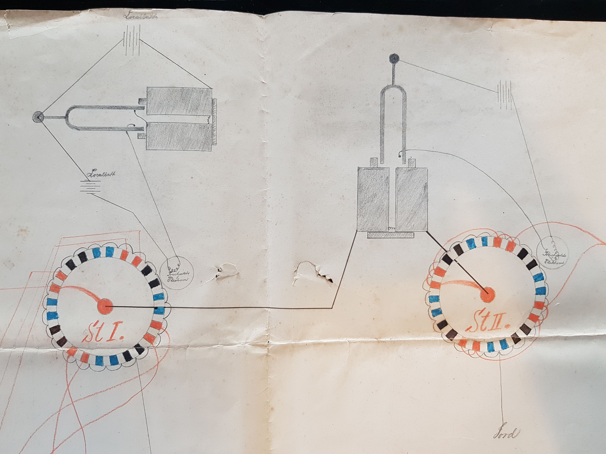

Poul la Cour nævner da også i patentet at det er en fordel at anvende en anden kontakt end den der forudsager gaflens svingning, til at udtrække gaflens svingninger. Dette ses illustreret på gaffelapparatet i venstre side af ovenstående tegning. Hertil kommer at der skal tilføjes endnu et batteri på modtager siden.

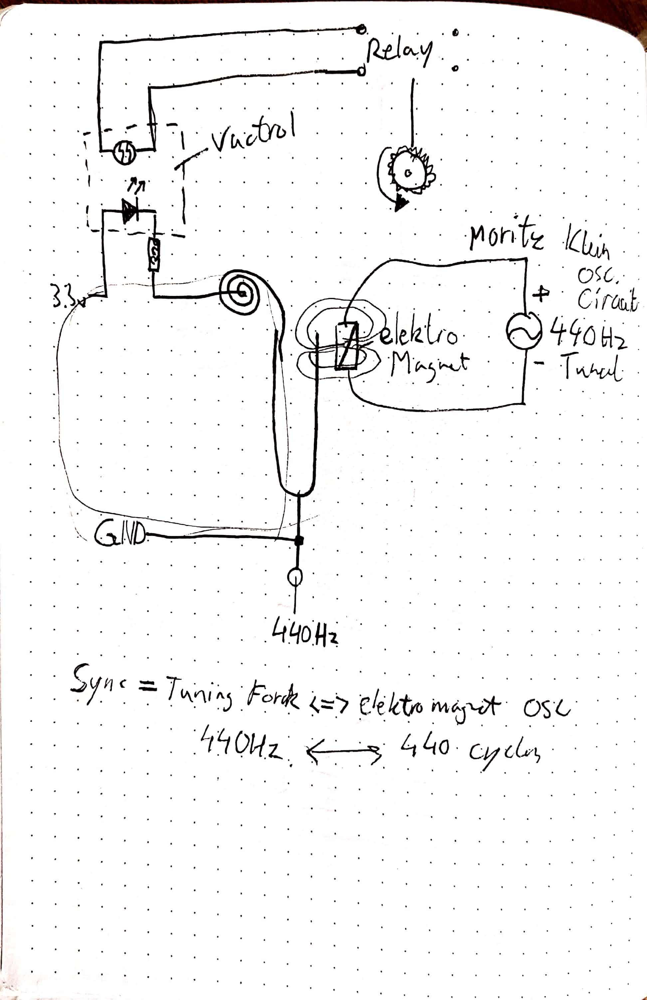

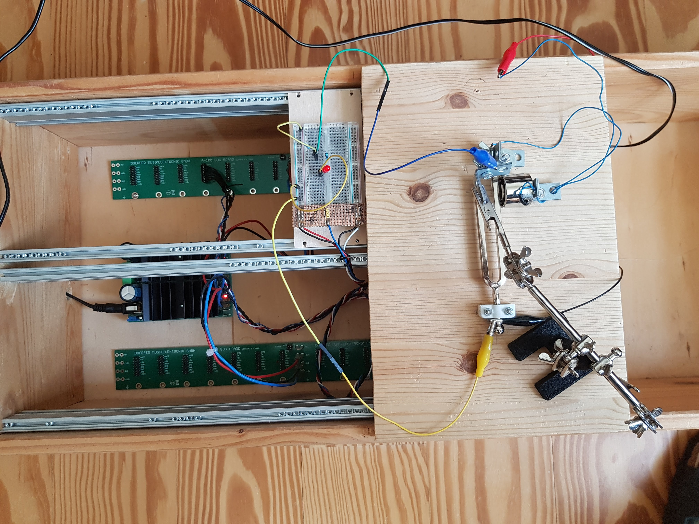
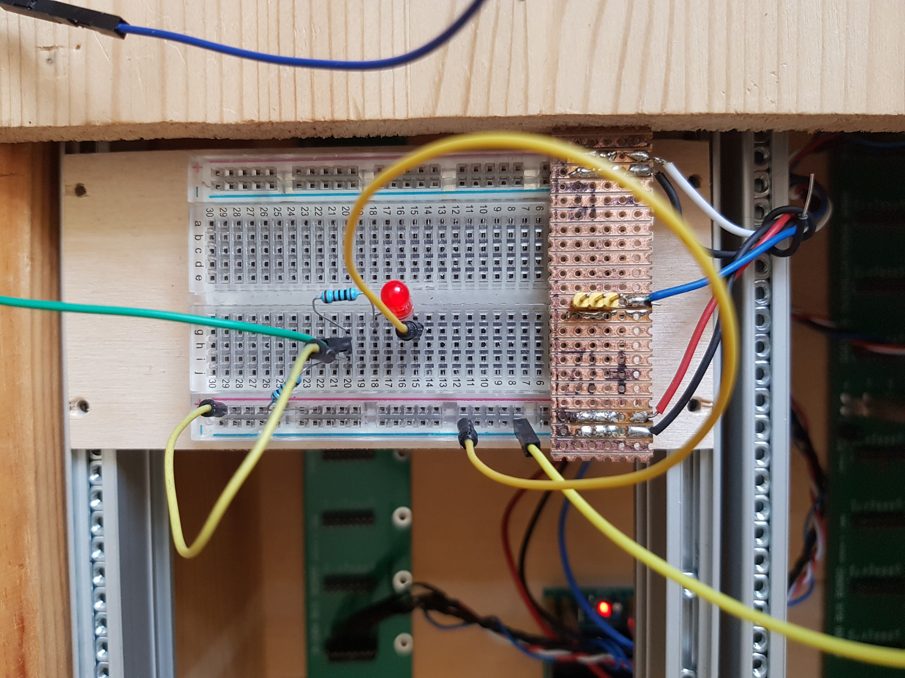

- Når kontakten røre let ved stemmegaffelgrenen da slukkes LED'en.
- afhængig af hvor hårdt jeg presser kontakten mod stemmegaflen vil jeg få skarpe eller sløve blink fra LED'en.

#### Bipolar Bølger
Poul la Cour nævner at man for at kunne opnå bipolare tonestrømme kan tilføje en tredje kontakt der altså i modsætning til den anden kontakt der sidder på indersiden i let berøring med gaffelgrenen, andbringes på ydersiden uden at røre gaffelgrenen.

> *"Man kan saaledes, ved i disse to Broer at indskyde 2 batterier, af hvilke det ene sender en positiv Strøm fra Contact til Gaffel, det andet en negativ fra Contact til Gaffel, lade Gaflen og den derefter følgende Ledning gjennemløbe af en Tonestrøm, hvis Halvbølger have skiftende strømretning" - Poul la Cour 1878*

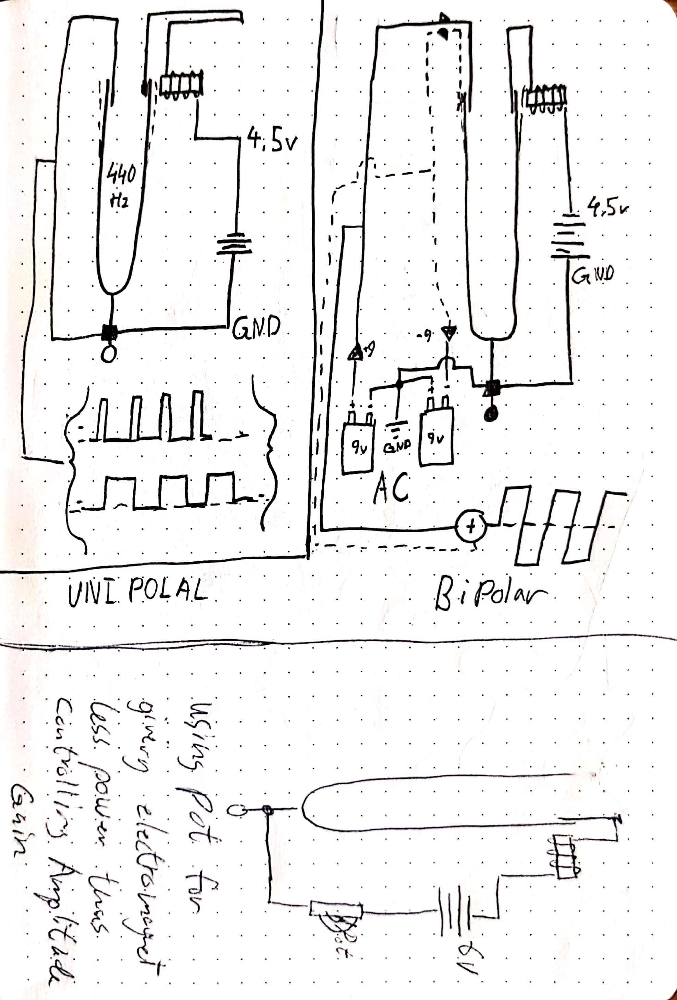

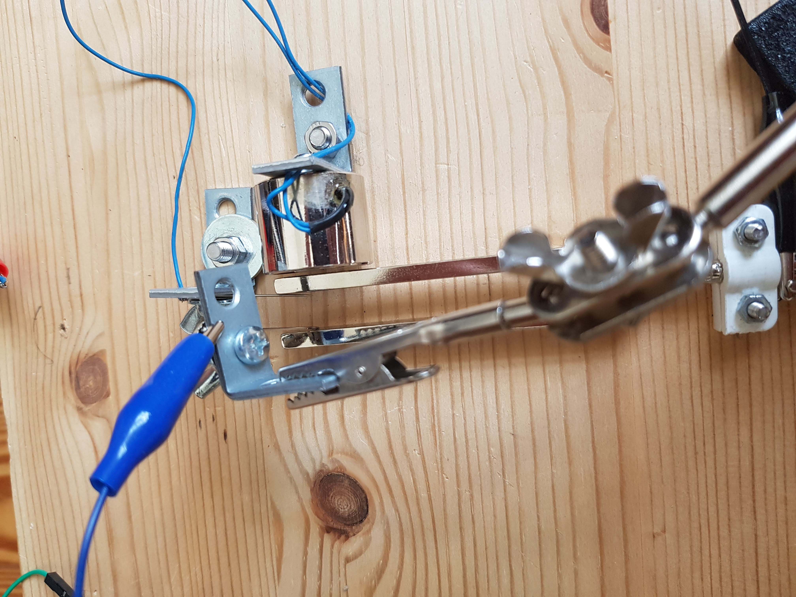
Når en kontakt skal påsættes stemmegaflen er den største udfordring altid at finde ud af hvordan denne monteres. I tilfældet med at lave en dobbelt kontakt til bipolar bølger er det vigtigt at kontakterne sidder med en kort afstand fra hinanden (stemmegaffelgrens bredde) uden at de på nogen måde er i ledende forbindelse med hinanden.

### Konstruktion af Dobbelt-kontakt

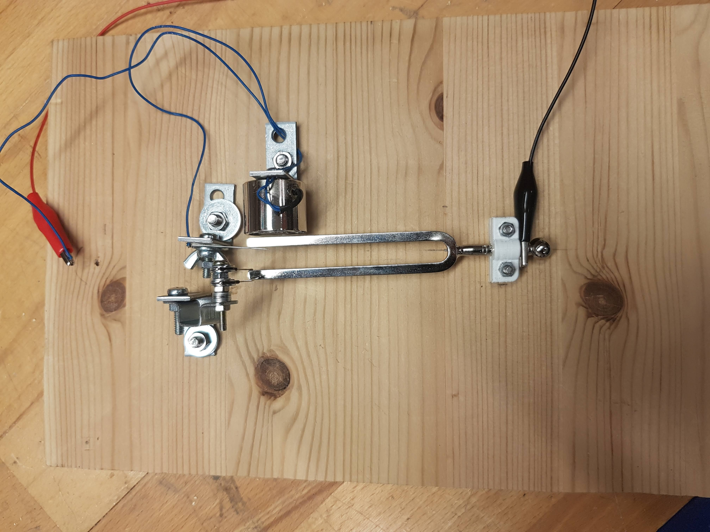

for at kunne imødegå Poul la Cours tonestrøms-apparat og dets iboende egenskab til at kunne skabe bipolare bølger, anså jeg det som nødvendigt at konstruere en dobbelt kontakt der både ville kunne anvendes til unipolar og bipolar bølger.

De to parametre der i denne konstruktion er altafgørende er for det første placeringen af de to kontakter. Afstanden mellem de to kontakter skal være næsten lig stemmegaffelgrenens-bredde med få millimeter ekstra for at kontakten vil have den ønskede virkning. For det andet må de to kontakter nødvendigvis være isoleret fra hinanden og stativet det holder dem.

Hvoraf det første parameter med afstanden var et spørgsmål om at anvende møtrikker og diske til at justere afstanden mellem de to kontakter, var det andet parameter med kontakternes isolerethed et større problem. I min proces havde jeg først forsøgt med at anvende "heatshrink-tubing" omking den del af kontakten der skulle holdes, idet gummi ikke er strømledende.

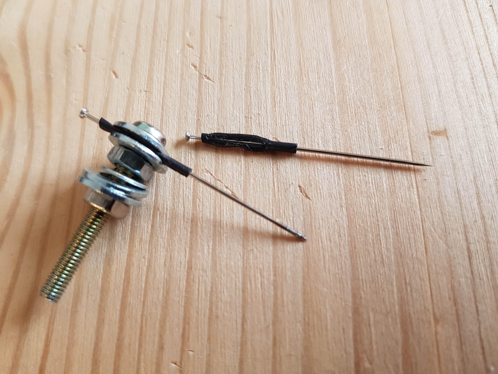

Men idet kontakternes skal spændes ret hårdt fast flækkes gummiet og kontakten står således i elektrisk forbindelse til stativet og den anden kontakt. Dette kan determineres ved at anvende et multimeter med "continuity" setting, der afgiver en beep hvis der er forbindelse. For at min opstilling skal virke er det afgørende at kontakterne er isoleret fra hinanden.

For at isolere de to kontakter har jeg overvejet at anvende silikone-spray og spraye delene på stativet for således at fratage dem der egenskab til at lede strøm. En anden løsning kunne være at anvende elektrisk tape istedet for gummi og se om det holder bedre når det spændes fast.

#### Isolation af dobbeltkontakt
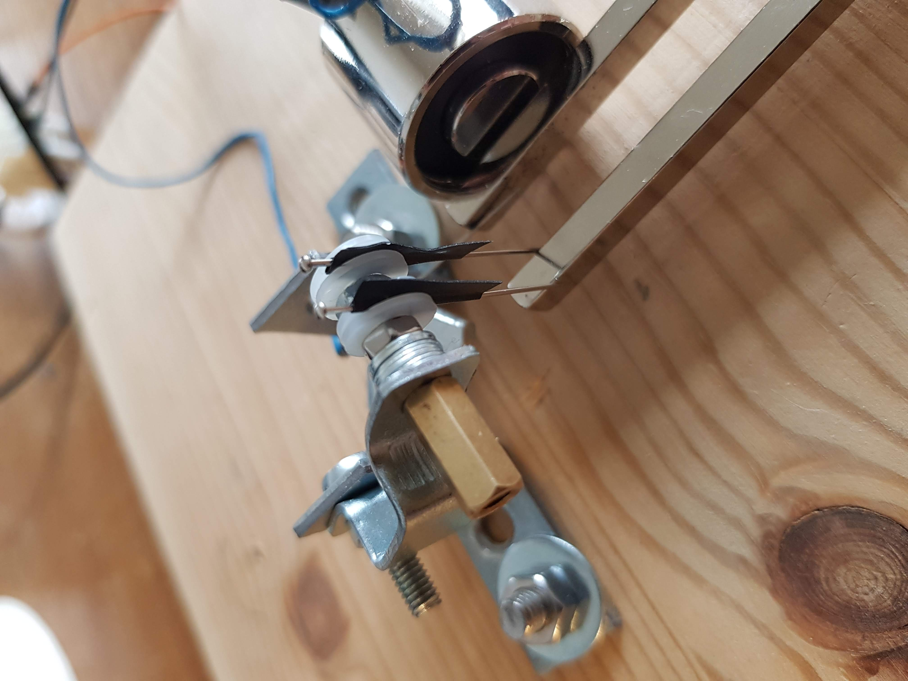
istedet for at anvende silikone-spray valgte jeg at anvende elektrisk-isoleringstape samt bruge plastik-diske istedet for metal diske til at holde de knappenåle jeg anvender som kontakter. Efter at have testet for continuity med mit multimeter kunne jeg konstaterer at de to kontakter nu var uafhængige af hinanden og dermed stativet.
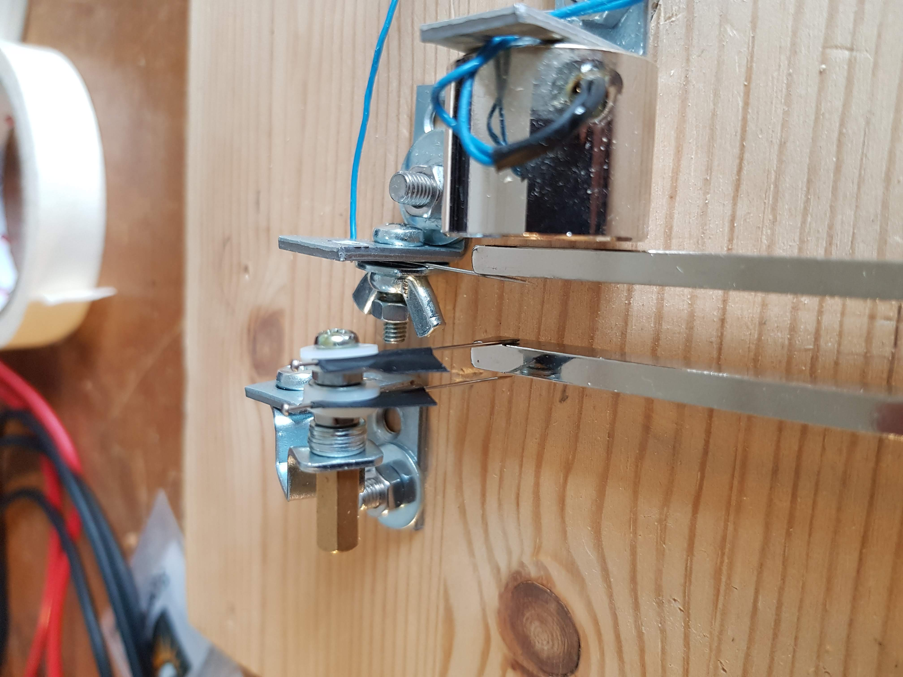

### Tonestrøms signaler
Idet jeg nu har en stemmegaffel der kan bringes i svingninger af en elektromagnet med en kontakt der således fungerer som en selvafbryder på den ene af stemmegaflens grene, og jeg på den anden nu har en fungerende dobbeltkontakt, kan jeg nu test begynde at udtrække signaler fra tonestrøms-apparattet.

med en 12V AC strømforsyning fra et Doepfer A-100 DIY kit kunne jeg således påfører en positiv(blå) og en negativ(hvid) spænding på dobbeltkontakten. Samt forbinde GND(Gul) til stemmegaflen fra AC strømforsyningen.

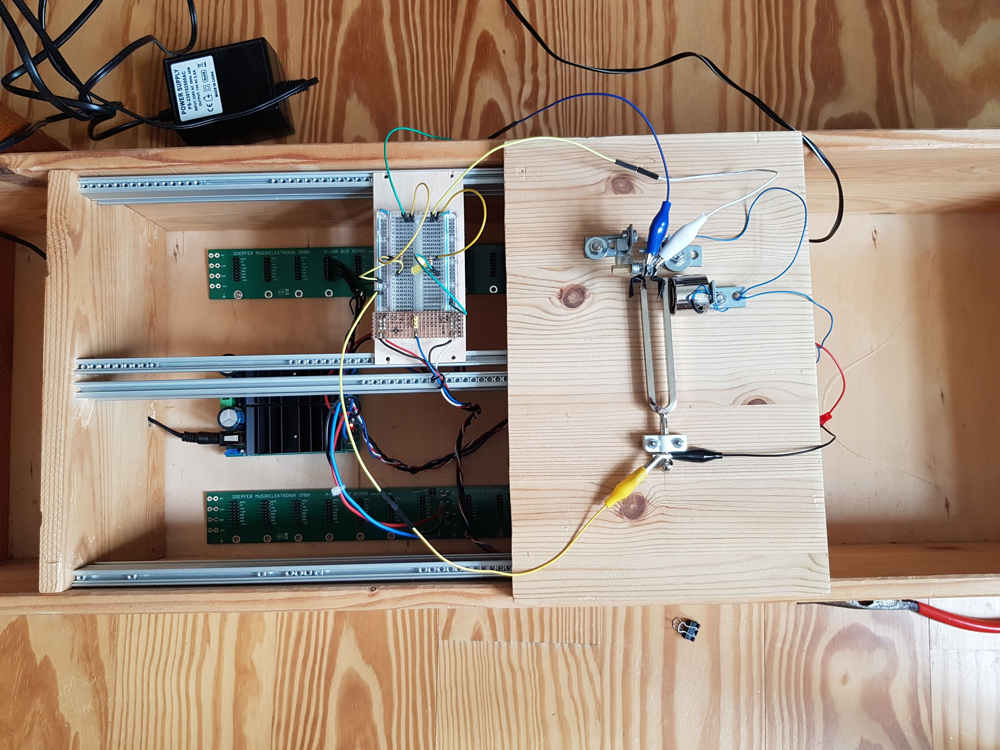

Den positive og negative kontakt er forbundet til hver deres simple LED kredsløb på et breadboard, hvorfra jeg således kunne konstaterer at hvis den positive kontakt berøre stemmegaflens yderside, da vil den venstre LED lys og den højre LED være slukket, og modsat hvis den negative kontakt berøre stemmegaflens inderside.

imidlertid finder jeg dog også at jeg kan få begge LED'er til at lyse samtidigt hvis jeg placerer de to kontakter i samme afstand fra stemmegaflen. Dette er potentielt problematisk idet de to LED'er helst skal stå i et modsat forhold til hinanden.

I Poul la Cours tonestrøms-apparat kan man se hvordan han har anvendt små fjedre til sørge for dette modsætningsforhold. I min version valgte jeg at anvende en jernklemme hvorom der er viklet elektrisk-tape for at jernet ikke skal danne en kontakt mellem de to kontakter.

#### Sonic Archaeology Method
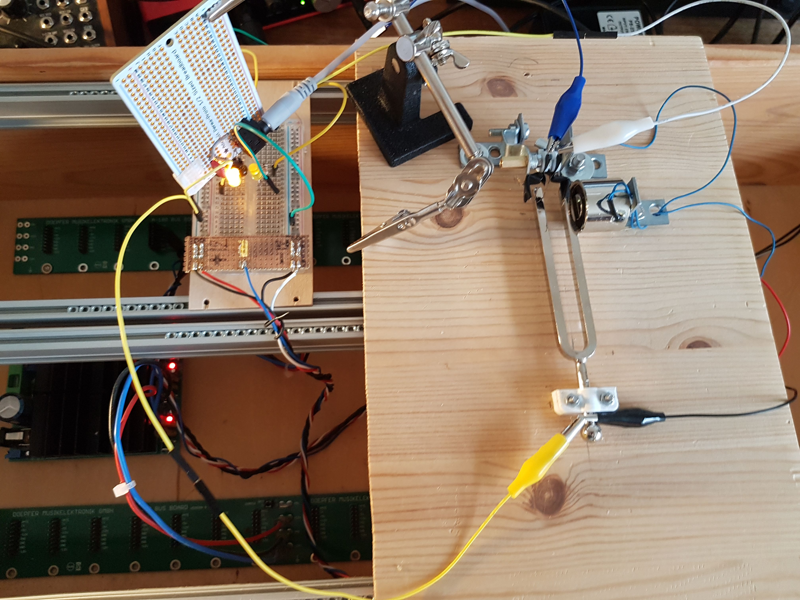
I denne test anvendte jeg en hjemmebygget betafield mikrofon til at opfange strømmen fra LED'ernes intermitterende blink og omforme dem til et audiosignal der kunne optages og analyseres i Ableton Live.
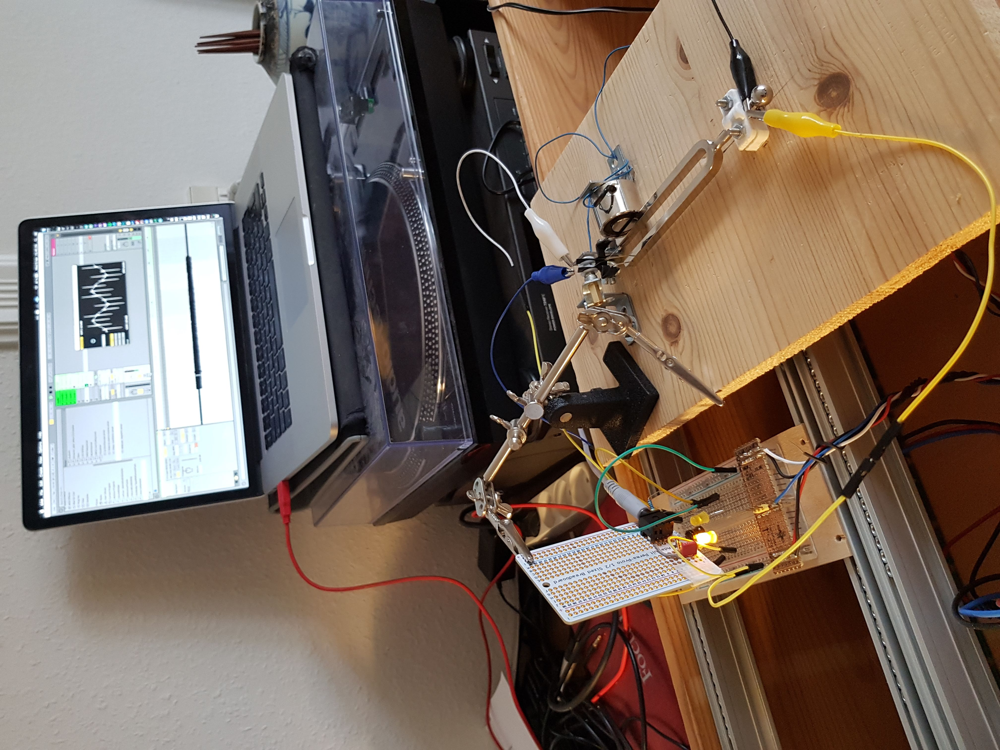
Med dette setup afviklede jeg tre på hinanden følgende optagelser. Først optog jeg kun blink fra det positive signal, så optog jeg kun blink fra det negative signal, og endelig optog jeg begge signaler samtidigt.

Efter at have lavet optagelserne kunne jeg ved at anvende det lavfrekvente brummende signal fra min hjemmebyggede betafield mikron til at synkroniserer de tre optagelser. umiddelbart var der ikke nogen hørbar eller grafisk visuel forskel på de tre signaler, dog fandt jeg at hvis jeg afspillede de positive og negative signaler samtidig pannet dem i hhv left og right channel, og nedsatte deres afspilningshastighed med -55 semitones at man kunne høre hvordan de to signaler stod i et modsætningsforhold til hinanden, ligesom LED'ernes blink og Kontakternes berøring med stemmegaffelgrenen.
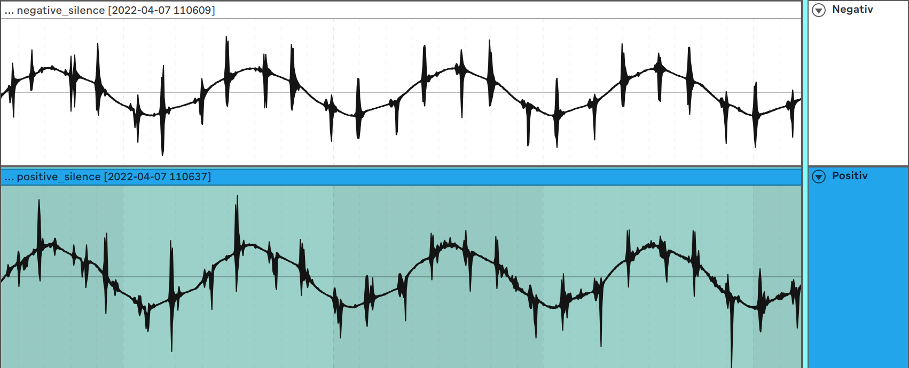

[Listen](https://github.com/L4COUR/TuningFork-Oscillator/raw/main/media/Tonestromme.mp3)
